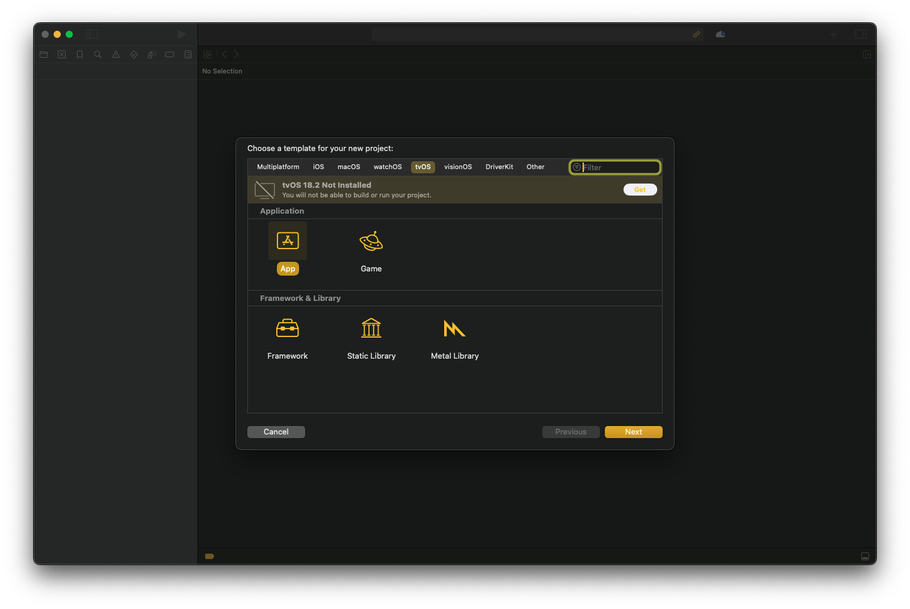
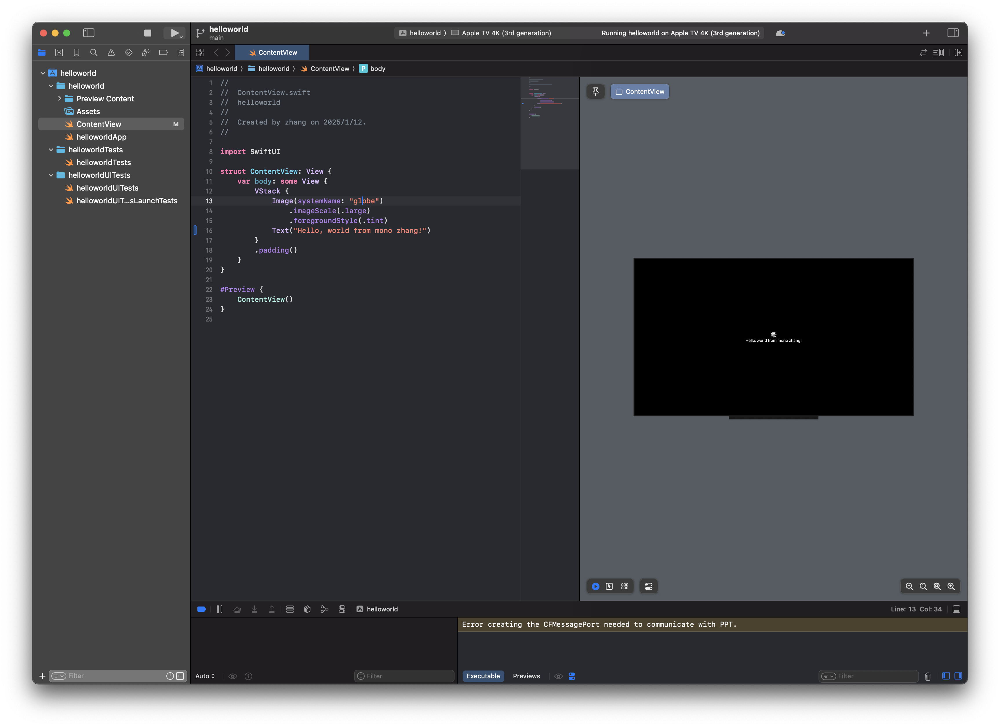
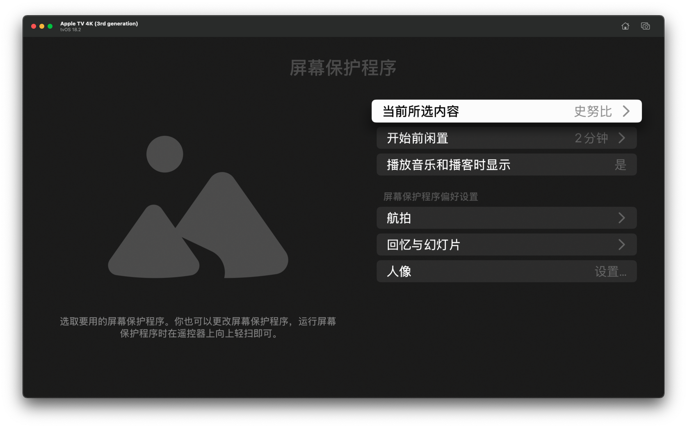
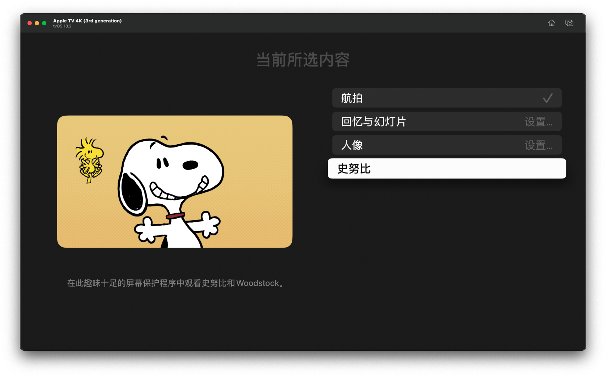
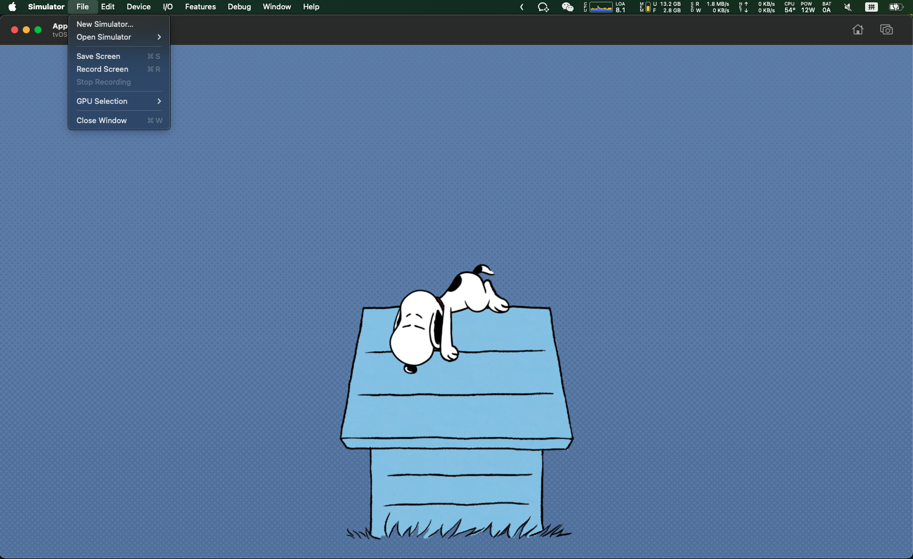
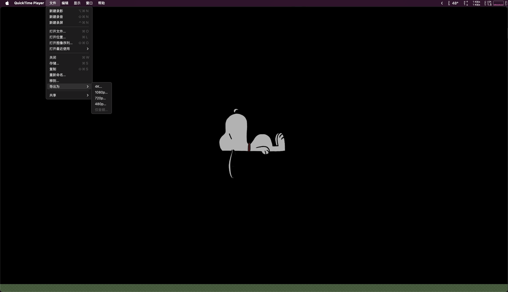
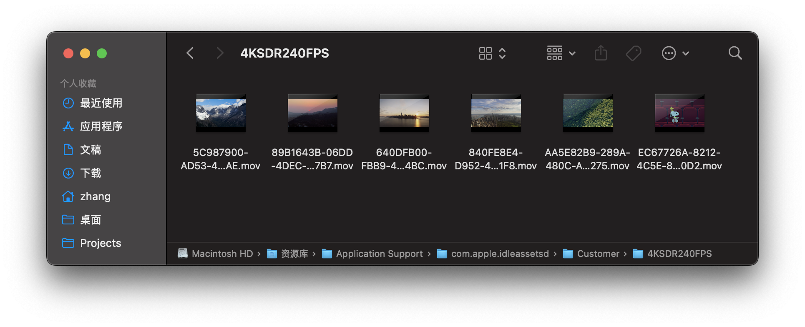
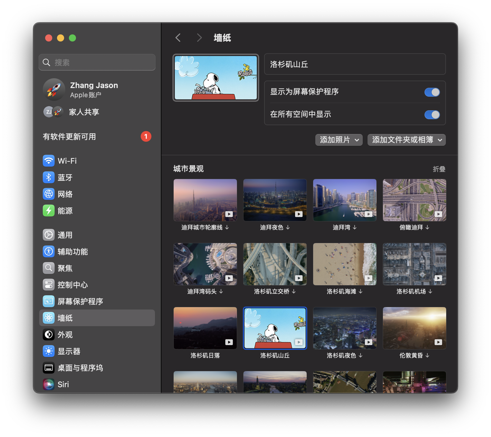
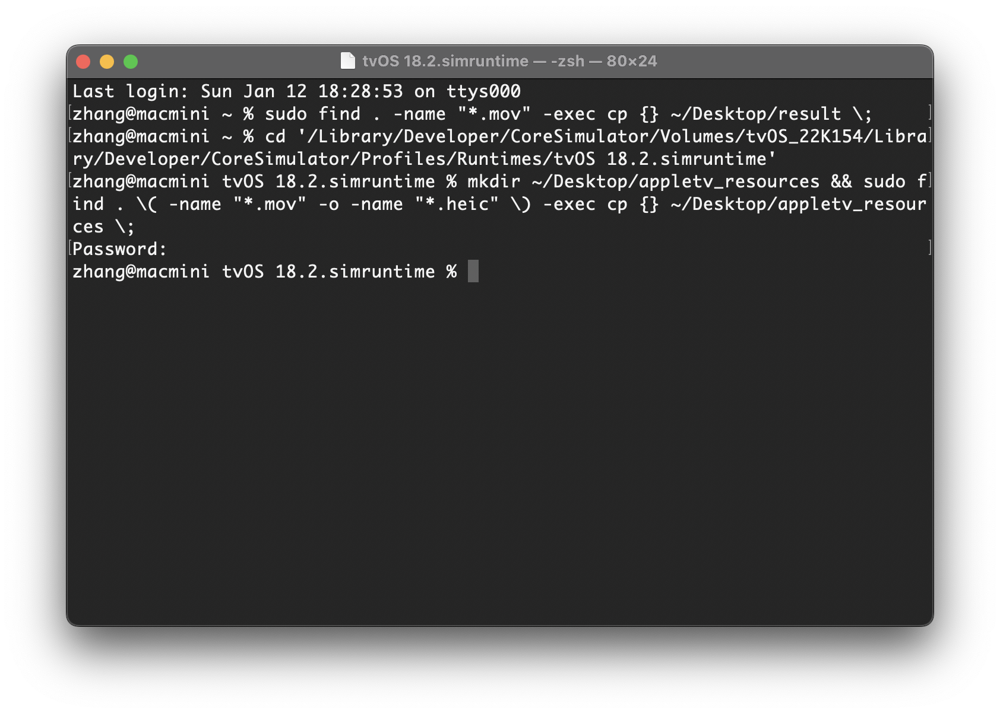

# Apple TV屏保在macOS上使用指南

## 思路：

从Apple TV SDK中获取源文件，替换macOS上动态壁纸的源文件。

## 步骤概要：

1. 安装Xcode
2. 新建一个tvOS的工程，以获取tvOS的模拟器镜像
3. 获取屏保资源，这里有两种方式：
   1. 直接对模拟器进行录屏（最简单）
   2. 从镜像中提取相关文件，并拷贝到指定目录后自行选择感兴趣的内容进行剪辑。（高定制化）
4. 替换到macOS的动态壁纸，完成！

> [!WARNING]
>
> 根据*Xcode and Apple SDKs Agreement*，请勿在非Apple品牌电脑上运行该SDK，仅供个人使用，请勿分发。

## 1.安装Xcode

打开App Store，搜索并安装Xcode


## 2.新建一个tvOS的项目并获取tvOS环境

1. 打开Xcode并点击新建项目 `Create New Project...`


2. 点击tvOS选项卡，选择工程类型为`App`，同时，窗口提示`tvOS xx.x Not Installed` ，点击Get按钮安装SDK



## 3. 运行tvOS模拟器

1. tvOS模拟器安装完成后，我们点击 ▶︎ 编译运行demo，如果顺利的话，将会启动tvOS模拟器。

   > [!NOTE]
   >
   > tvOS版本号为18.2(22K154)
   >
   > 

   



 - 2025-01-13 at 22.48.34.png)

3. 点击按钮返回主页面，通过方向键选择`设置`图标，按回车键进入设置页面，选择屏幕保护程序，选择喜欢的屏保程序,返回主页面后生效。



## 4. 获取屏保

如前面说提的，分两种思路：

1. 直接对模拟器进行录屏（最简单）
2. 从镜像中提取相关文件，并拷贝到指定目录后自行选择感兴趣的内容进行剪辑。（高定制化）

首先介绍最简单的录屏方法：

### 4.1 录屏

当空置一段时间后，tvOS将会进入屏幕保护程序，如前面设置的2分钟，当屏保出现时，我们点击菜单栏：

`File -> Record Screen`或快捷键⌘+R开始录制，录制完毕后，点击File -> Stop Recording，停止录制，视频文件将会保存到桌面。



### 4.2 转换格式

macOS的动态屏保使用的是HEVC编码格式的视频格式，因此我们要转换格式。

使用QuickTime（默认视频程序）打开录制好的视频，点击菜单栏：

`文件 -> 导出为-> 4k...` 



选择较小文件大小（HEVC），点击存储，等到导出结束。


### 4.3 设置为动态壁纸

💡该方法其实等同于你可以自定义任何自己想放的视频了！

打开访达（Finder），点击菜单栏：

`前往 -> 前往文件夹...`

在弹出的地址栏中输入：可用Tab键补全

`/Library/Application Support/com.apple.idleassetsd/Customer/4KSDR240FPS`


按回车后弹出动态壁纸的目标目录，内容类似如下：



为了方便，我们采用直接替换视频的方式：

1. 选择一个不会设置的动态壁纸视频（如果没有请在设置->墙纸->动态墙纸中随便下载一个，并记住它的名字，如洛杉矶山丘），选中后按回车复制文件名，比如洛杉矶山丘的动态墙纸文件名字为`EC67726A-8212-4C5E-83CF-8412932740D2.mov`（必须是现有的视频）。
2. 重命名4.2章节中转换好的mov格式视频文件为刚才复制的文件名。
3. 将转换好的mov格式视频文件覆盖到当前的`4KSDR240FPS`目录下


## 5. 大功告成！

将你的动态墙纸设置为替换的视频即可！**封面还是原来的封面，不必担心，内容已经更换**。如果你想把封面也更换了，请自行替换其缩略图。

缩略图文件地址：`/Library/Application Support/com.apple.idleassetsd/snapshots`

图片要求：214x130px,jpg格式，理论上你还可以将标题给改了，本文暂不阐述。




🎉屏保已经替换为AppleTV的屏保啦！

## 6. 进阶玩法

可能有人会好奇，为什么每次屏保的内容都感觉不一样呢？又比如Apple Watch中Snoopy主题表盘，每次都会给我们新鲜感，接下来我将会揭秘，同时这也是获取原始素材的教程，如果你安装了其他版本的镜像，也许会有更多的彩蛋等你揭晓，思路是相通的，你也可以用来提取其他OS的文件。

### 6.1 进入tvOS文件系统

打开终端，输入以下命令：注意，版本号也许会有所不同，可通过tab补全

```shell
cd '/Library/Developer/CoreSimulator/Volumes/tvOS_22K154/Library/Developer/CoreSimulator/Profiles/Runtimes/tvOS 18.2.simruntime'
```

### 6.2 拷贝文件

在此目录下运行以下命令：

命令含义：在桌面新建一个名字为`appletv_resources`的文件夹，同时在当前目录递归查找后缀名为mov及heic的文件，将结果拷贝到桌面的`appletv_resources`文件夹中。

```shell
mkdir ~/Desktop/appletv_resources && sudo find . \( -name "*.mov" -o -name "*.heic" \) -exec cp {} ~/Desktop/appletv_resources \;
```



✨稍等片刻，待执行完毕后，在桌面的`appletv_resources`文件夹中，便可找到所有的屏保资源。


### 6.3 内容分析

其中mov是视频文件，heic是静态图像（集），当前教程并没有将heic也替换掉，因此屏保程序退出后，只会显示第一帧图像（待各位继续研究下了）。

观察文件名，我们发现有以下的规律模式：

```
Intro_From_XXX.mov
Outro_To_XXX.mov
XXX_Loop.mov
```

不难看出，AppleTV的屏保、AppleWatch的表盘随机性的实现方式可能就是通过不同的**Intro+Loop*n+Outro+heic**叠加组合而成，并在特殊的节日显示彩蛋。

你现在就可以通过视频剪辑软件，将自己喜欢的片段拼合到一起，最终导出视频文件，然后按照章节4.2、4.3的方式替换为macOS的屏保。

🤔：momo尝试单独运行AppleTV上的屏保程序,理论上是可以运行的，架构支持，但实际上会报环境变量为设置，然后断言退出了（待有空研究）：

```shell
zhang@macmini TVScreenSaver.app % pwd
/Library/Developer/CoreSimulator/Volumes/tvOS_22K154/Library/Developer/CoreSimulator/Profiles/Runtimes/tvOS 18.2.simruntime/Contents/Resources/RuntimeRoot/Applications/TVScreenSaver.app
zhang@macmini TVScreenSaver.app % file TVScreenSaver 
TVScreenSaver: Mach-O universal binary with 2 architectures: [x86_64:Mach-O 64-bit executable x86_64] [arm64:Mach-O 64-bit executable arm64]
TVScreenSaver (for architecture x86_64):	Mach-O 64-bit executable x86_64
TVScreenSaver (for architecture arm64):	Mach-O 64-bit executable arm64
```

